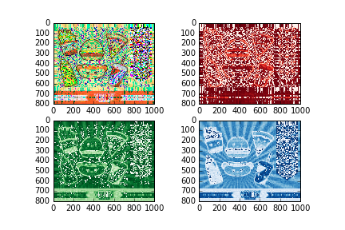

UECM3033 Assignment #2 Report
========================================================

- Prepared by: Lim Mei Kuan
- Tutorial Group: T2

--------------------------------------------------------

## Task 1 --  $LU$ Factorization or SOR method

The reports, codes and supporting documents are to be uploaded to Github at: 

[https://github.com/Limmeikuan/UECM3033_assign1](https://github.com/Limmeikuan/UECM3033_assign1)

Explain your selection criteria here.

Explain how you implement your `task1.py` here.
In task 1 , 

---------------------------------------------------------

## Task 2 -- SVD method and image compression

Put here your picture file (Image.jpg)

How many non zero element in $\Sigma$?
All the three red, green and blue $\Sigma$ are non zero elements. 

Put here your lower and better resolution pictures.  
Explain how you generate these pictures from `task2.py`.

This figures show when the $\Sigma$ is keeping the first 30 and 200 non zero elements.
In order to generate the pictures, firstly, push the new "Image" by using github.Then, the image is needed to be read in order to get the 3 matrices which is the r,g and b. Each of the r,g and b is a 3 dimension matrix. In order to find the U,$\Sigma$ and V of the three matrices which named as Ur,Sr and Vr for the red matrix, Ug,Sg,Vg for the green matrix and Ub,Sb,Vb for the blue matrix, scipy.linalg.svd is used. Then, the image is plotted by using "plt.figure". After that, to find the non zero elements in $\Sigma$, numpy.count_nonzero can be used. Next, image is needed to be compressed by keeping the first 30 non zero elements as in $\Sigma$ and set all other non zero elements to zero. This will construct a lower resolution matrix.A self define function is created for this purpose. Firstly, a copy of the original $\Sigma$ to avoid loss of information by using Sr.copy and same goes to blue and green. Then only start to keep the first n non zero elements and set others to zero by using Sr1[n:800]=np.zeros_like(Sr[n:800]). Then, the Sr1 is needed to be change to dimension (800x1000) which is originally (800,1) by using sp.linalg.diagsvd so that no dimensional error will occur when combine it to a matrix of U,$\Sigma$,V by dot multiplication. So, a new matrix is created by the dot multiplication of np.dot. Then, all the process is repeated by green and blue matrices. After all this, another figure is plotted which shows a lower resolution. In part 4, a new better resolution can be plotted by calling the self define function again.      

What is a sparse matrix?

-----------------------------------

last modified: 10 March 2016
